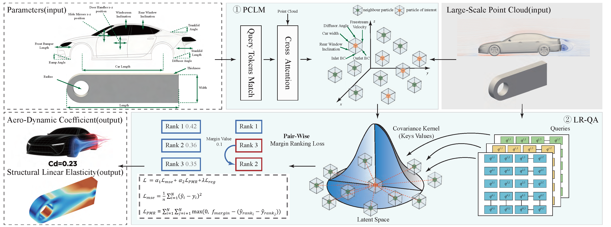

# 🚀 LRQ-Solver: A Transformer-Based Neural Operator for Fast and Accurate large-scale 3D PDEs

> Fast, accurate, and scalable simulations of industrial-grade 3D geometries — powered by physics-aware learning and linear-complexity attention.



**LRQ-Solver** is a deep learning framework designed to solve large-scale partial differential equations (PDEs) on complex 3D geometries with unprecedented efficiency. Built upon two core innovations:

- **PCLM (Physics-Coupled Learning Module)**: Embeds physical consistency into the model architecture, enabling robust generalization across unseen design configurations.
- **LR-QA (Low-Rank Query Attention)**: Reduces attention complexity from $O(N^2)$ to $O(NC^2 + C^3)$ via covariance decomposition, enabling training on up to **2 million points** on a single GPU.

## 📁 Dataset
Dataset link: [kenalin/drivaerpp](https://www.modelscope.cn/datasets/kenalin/drivaerpp)
```bash
#To download the full dataset:
modelscope download --dataset kenalin/drivaerpp

#To download a specific file (for example README.md into a local folder named dir):
modelscope download --dataset kenalin/drivaerpp README.md --local dir
```

✅ **Results**:
- **38.9% error reduction** on DrivAer++ dataset  
- **28.76% error reduction** on 3D Beam dataset  
- **Up to 50× training speedup** over baseline methods  

🔗 Code for reproducing state-of-the-art multi-configuration physics simulations.

---

## 📁 Repository Structure

```text
LRQ-Solver/
├── configs/                # Training & model configuration files
├── ppcfd/                  # Core solver modules & physics-integrated layers
├── main_drivaer.py         # Entry point for DrivAer++ experiments
├── main_beam.py            # Entry point for 3D Beam experiments
├── run_LRQSOLVER_drivaer.sh# Shell script to run DrivAer++ pipeline
├── run_LRQSOLVER_beam.sh   # Shell script to run 3D Beam pipeline
├── visual_beam.py          # Visualization utilities for beam results
├── drag_coefficient.py     # Post-processing for aerodynamic metrics
├── requirements.txt        # Python dependencies
├── .pre-commit-config.yaml # Pre-commit hooks for code quality
└── README.md               # You are here!
```

## ⚙️ Quick Start

1. **Clone the repository**
```bash
git clone https://github.com/LilaKen/LRQ-Solver.git  
cd LRQ-Solver
```

2. **Install dependencies**
```bash
pip install -r requirements.txt
```

3. **Run an experiment**
```bash
#For DrivAer++ dataset
run_LRQSOLVER_drivaer.sh

#For 3D Beam dataset
bash run_LRQSOLVER_beam.sh

#Visualize results (e.g., beam)
python visual_beam.py --checkpoint ./outputs/beam/model.pth
```

If you find LRQ-Solver useful in your research, please consider citing our work:
```
@article{zeng2025lrq,
  title={LRQ-Solver: A Transformer-Based Neural Operator for Fast and Accurate Solving of Large-scale 3D PDEs},
  author={Zeng, Peijian and Wang, Guan and Gu, Haohao and Hu, Xiaoguang and Wang, Zhuowei and Yang, Aimin and Song, Xiaoyu and others},
  journal={arXiv preprint arXiv:2510.11636},
  year={2025}
}
```

## Acknowledgements

We sincerely thank the following open-source projects for their valuable contributions to this work:

- [PaddleScience](https://github.com/PaddlePaddle/PaddleScience) – Baidu’s scientific machine learning toolkit for physics-informed deep learning.
- [DrivAerNet](https://github.com/Mohamedelrefaie/DrivAerNet) – The large-scale CFD dataset and benchmark from MIT.
- [PaddleCFD](https://github.com/PaddlePaddle/PaddleCFD) – The PaddlePaddle-based framework for aerodynamic simulation and shape optimization.

