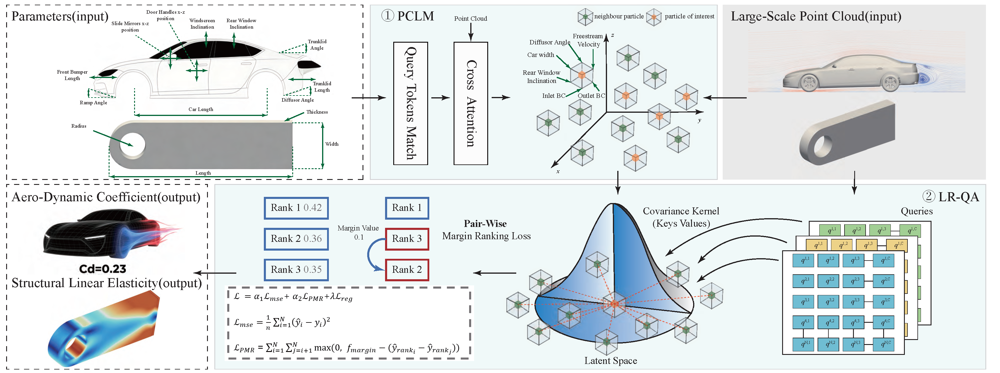

# 🚀 LRQ-Solver: A Transformer-Based Neural Operator for Fast and Accurate large-scale 3D PDEs

> Fast, accurate, and scalable simulations of industrial-grade 3D geometries — powered by physics-aware learning and linear-complexity attention.



## 📰 Publication

Our paper has been accepted by *Computer-Aided Design* (Elsevier) and is available on ScienceDirect:

**LRQ-Solver: A Transformer-Based Neural Operator for Fast and Accurate Solving of Large-scale 3D PDEs**  
[Read the article on ScienceDirect](https://www.sciencedirect.com/science/article/pii/S0010448526001211?dgcid=coauthor)

**LRQ-Solver** is a deep learning framework designed to solve large-scale partial differential equations (PDEs) on complex 3D geometries with unprecedented efficiency. Built upon two core innovations:

- **PCLM (Physics-Coupled Learning Module)**: Embeds physical consistency into the model architecture, enabling robust generalization across unseen design configurations.
- **LR-QA (Low-Rank Query Attention)**: Reduces attention complexity from $O(N^2)$ to $O(NC^2 + C^3)$ via covariance decomposition, enabling training on up to **2 million points** on a single GPU.

## 📁 Dataset
Dataset link: [kenalin/drivaerpp](https://www.modelscope.cn/datasets/kenalin/drivaerpp)
```bash
#To download the full dataset:
modelscope download --dataset kenalin/drivaerpp

#To download a specific file (for example README.md into a local folder named dir):
modelscope download --dataset kenalin/drivaerpp README.md --local dir
```

## 📦 Model Weights

Pre-trained model weights are available for download:

- **LRQSolver_100000.zip**: Full model weights (Baidu Netdisk link: https://pan.baidu.com/s/1ZghF4w8TU5hYhS4RV7Po6w Password: k8mg)
- **LRQSolver_1024.zip**: Lightweight model weights (Baidu Netdisk link: https://pan.baidu.com/s/1-NA_CSbUs8fukivIADyURg Password: qybq)

✅ **Results**:
- **38.9% error reduction** on DrivAer++ dataset  
- **28.76% error reduction** on 3D Beam dataset  
- **Up to 50× training speedup** over baseline methods  

🔗 Code for reproducing the results reported in our *Computer-Aided Design* article.

---

## 📁 Repository Structure

```text
LRQ-Solver/
├── configs/                # Training & model configuration files
├── ppcfd/                  # Core solver modules & physics-integrated layers
├── main_drivaer.py         # Entry point for DrivAer++ experiments
├── main_beam.py            # Entry point for 3D Beam experiments
├── run_LRQSOLVER_drivaer.sh# Shell script to run DrivAer++ pipeline
├── run_LRQSOLVER_beam.sh   # Shell script to run 3D Beam pipeline
├── visual_beam.py          # Visualization utilities for beam results
├── drag_coefficient.py     # Post-processing for aerodynamic metrics
├── requirements.txt        # Python dependencies
├── .pre-commit-config.yaml # Pre-commit hooks for code quality
└── README.md               # You are here!
```

## ⚙️ Quick Start

1. **Clone the repository**
```bash
git clone https://github.com/LilaKen/LRQ-Solver.git  
cd LRQ-Solver
```

2. **Install dependencies**
```bash
pip install -r requirements.txt
```

3. **Run an experiment**
```bash
#For DrivAer++ dataset
run_LRQSOLVER_drivaer.sh

#For 3D Beam dataset
bash run_LRQSolver_beam.sh

#Visualize results (e.g., beam)
python visual_beam.py --checkpoint ./outputs/beam/model.pth
```

## Acknowledgements

We sincerely thank the following open-source projects for their valuable contributions to this work:

- [PaddleScience](https://github.com/PaddlePaddle/PaddleScience) – Baidu's scientific machine learning toolkit for physics-informed deep learning.
- [DrivAerNet](https://github.com/Mohamedelrefaie/DrivAerNet) – The large-scale CFD dataset and benchmark from MIT.
- [PaddleCFD](https://github.com/PaddlePaddle/PaddleCFD) – The PaddlePaddle-based framework for aerodynamic simulation and shape optimization.

## 📚 Citation

If you find LRQ-Solver useful in your research, please cite our paper:

```bibtex
@article{ZENG2026104151,
  title = {LRQ-Solver: A transformer-based neural operator for fast and accurate solving of large-scale 3D PDEs},
  journal = {Computer-Aided Design},
  volume = {200},
  pages = {104151},
  year = {2026},
  issn = {0010-4485},
  doi = {10.1016/j.cad.2026.104151},
  url = {https://www.sciencedirect.com/science/article/pii/S0010448526001211},
  author = {Peijian Zeng and Guan Wang and Haohao Gu and Xiaoguang Hu and Tiezhu Gao and Zhuowei Wang and Aimin Yang and Xiaoyu Song},
  keywords = {Computer-aided design, Aerodynamic drag coefficient, Deep learning, Three-dimensional geometry},
  abstract = {Solving large-scale PDEs on complex three-dimensional geometries remains a central challenge in scientific and engineering computing, often due to expensive pre-processing stages and high computational overhead. We present Low-Rank Query-based PDE Solver (LRQ-Solver), a physics-integrated deep learning framework for efficient CAE simulations of complex three-dimensional geometries in CAD-driven design analysis. Built upon the Parameter-Conditioned Lagrangian Modeling (PCLM) that embeds physical consistency into the learning process and the Low-Rank Query Attention (LR-QA) module that reduces attention complexity from O(N2) to O(NC2+C3) via covariance decomposition, LRQ-Solver supports multi-configuration analysis within iterative design workflows. On two benchmark datasets, it achieves a 28.6% error reduction on DrivAerNet++ and 28.76% on the 3D Beam dataset, while supporting simulations with 2 million points under a 40 GB memory budget. These results indicate its potential for accelerating PDEs-based CAE tasks, such as aerodynamic drag estimation and structural stress analysis, in computational design pipelines. Code to reproduce the experiments is available at https://github.com/LilaKen/LRQ-Solver.}
}
```
